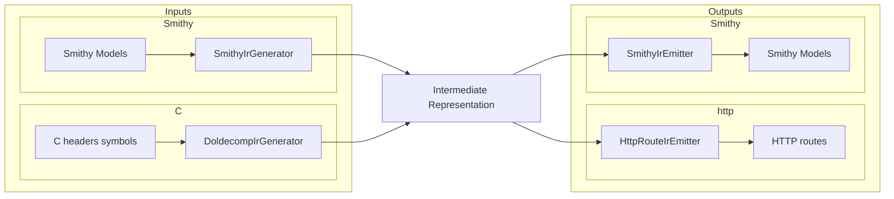

# AGENTS.md

## Cursor Cloud specific instructions

This is a Scala 2.13 / sbt project (build tool: `sbt`, JDK 21). `sbt` is preinstalled in the
Cloud VM snapshot and dependencies are refreshed by the startup update script (`sbt update`).

### Services / entrypoint

There is a single service: a read-only HTTP server that proxies debugger memory over DAP.
The entrypoint is `io.github.jacoby6000.daphttp.Cli` (a Decline CLI) with three subcommands:

- `smithy` — load API definitions from Smithy model files (`--smithy <path>` repeatable, `--watch`).
- `cheaders` — load from C headers + a doldecomp symbols file (`--symbols`, `--headers` repeatable,
  `--namespace`, `--service`, `--word-size`, `--data-sections`, `--report`) and run the HTTP server.
- `cheaders-smithy` — generate a Smithy model from C headers + symbols (`--symbols`, `--headers`,
  `--namespace`, `--service`, `--word-size`, `--data-sections`, `--report`, `--output`).

`smithy` and `cheaders` share DAP transport flags and `--bind-host/--bind-port`
(default `0.0.0.0:8080`). DAP transport is one of:

- TCP (default): `--dap-host/--dap-port` (default `127.0.0.1:4711`) — persistent TCP session
- Local pipe (client only): `--dap-pipe` — Unix domain socket (Linux/macOS) or Windows named
  pipe (`\\.\pipe\Name`)

Also shared: `--dap-timeout-ms`, `--dap-continue-timeout-ms`, `--dap-connect-timeout-ms`,
`--dap-connect-retry-ms`.

Intended peer for Melee/doldecomp workflows is the local `dolphin-dap` fork (sibling
`../dolphin-dap`), which listens via `Dolphin.General.DAPPort` (TCP) or
`Dolphin.General.DAPSocket` (Unix domain socket). Upstream Dolphin does not ship DAP yet.

Run with `sbt "run <subcommand> ..."`. Standard build/lint/test commands are documented in
`README.md` and `.github/workflows/ci.yml` (`sbt fmt`, `sbt fix`, `sbt test`, and CI's
`scalafmtCheckAll;scalafmtSbtCheck` / `scalafixAll --check`).

### DAP transport notes

- TCP client: `DapHttpServerMain.SocketDapClient`. Pipe/socket client: `LocalPipeDapClient`.
- Sessions are persistent, handshake with DAP `initialize`, serialize concurrent requests, and
  skip non-matching DAP events until the matching `response` arrives.
- `LocalPipeDapClient` opens the pipe/socket under cats-effect `Resource` so failed handshakes
  always close the connection; read/continue/connect use `IO.interruptible` + `IO.timeout`.
  Concurrent DAP requests are serialized with `Mutex[IO]` (one in-flight framing exchange).
- We are always a **client** to an adapter-owned endpoint (never create the pipe/socket).
  `--dap-pipe` matches VS Code's "named pipe" path convention: AF_UNIX connect on Unix
  (dolphin-dap `DAPSocket`), `RandomAccessFile(..., "rw")` for Windows `\\.\pipe\Name`.

### IR pipeline

Input formats converge on a shared IR, then emit HTTP routes or Smithy models:

`SmithyIrEmitter` builds a Smithy `Model` with smithy-model shape builders and serializes it via
`SmithyIdlModelSerializer` (do not hand-render Smithy IDL text).

### Modules

- **root (JVM)** — CLI, IR pipeline, http4s server (`io.github.jacoby6000.daphttp.Cli`).
- **ui (Scala.js)** — browser explorer under `ui/`; `Compile / resourceGenerators` copies
  `fastOptJS` + `index.html` into `web/` resources served at `/` and `/assets/main.js`.

### HTTP surface

| Path | Purpose |
|------|---------|
| `GET /` | HTML + Scala.js route explorer |
| `GET /assets/main.js` | Packaged Scala.js bundle |
| `GET /health` | Liveness |
| `GET /routes` | Flat `routes` list + `tree` (for the UI) + `errors` |
| `POST /resume` | DAP `continue` |
| `GET /api/...` | Generated memory / data routes |

### Non-obvious caveats

- `scalafmtOnCompile := true`, so `sbt compile` will reformat sources in place.
- Generated data routes are always under `/api` (`ApiRoutes.normalize`). Meta UI endpoints stay at
  the root so they never collide with a Smithy service named `api`.
- The `/health` and `/routes` endpoints work without a debugger. On startup the server immediately
  tries to connect to the DAP adapter (TCP or `--dap-pipe`; 1s TCP connect timeout per attempt,
  retrying every 5s until connected). Generated **data** routes reuse that persistent session
  (serialized across concurrent requests); if the adapter is not listening they return per-read
  `error` fields (the HTTP request still succeeds). To exercise data routes locally without a real
  debugger, run a mock that speaks DAP framing (`Content-Length: N\r\n\r\n` + JSON) over TCP or a
  Unix domain socket / Windows named pipe, responding with
  `{"success":true,"body":{"data":"<base64>"}}`.
- `IrSizingWarnings` logs non-fatal warnings to stderr when IR members use ambiguous Smithy
  prelude types (`Integer`, `Long`, `Float`, `Double`) without explicit width traits (`@u32`,
  `@f64`, etc.). Pointer members are excluded.
- C `enum` / Smithy `intEnum` values decode to the enumerator name in JSON. Values that do not
  match any enumerator decode as a hex literal (`0xN`), not a numeric type. Enumerator
  initializers, array bounds, and bitfield widths are evaluated with CDT `ValueFactory` after
  preprocessor expansion — never by hand-parsing `#define` text. Unevaluable explicit enum
  initializers warn instead of silently inventing sequential values. When scanning multiple
  headers, `*_Count` / `*_SelfCount` enumerator values are harvested iteratively (parse → inject
  valid Count sentinels as ScannerInfo macros → reparse, capped) so chains like
  `ftCo_MS_Count` → `ftMh_MS_Count` → `ftCh_MS_Count` resolve even when defining headers sort after
  consumers. Only Count sentinels that appear before any failed initializer in their enum are
  exported during enum reparse (avoids colliding with later redefinitions of the same enum tag).
  After enums merge, enumerator values are kept in a constant table for array-bound lookup
  (e.g. `jobjs[HUD_PLACE_MAX]`) — they are not injected into CDT ScannerInfo (that OOM'd on
  Melee-scale corpora). Opaque type macros such as melee `UNK_T` (`void*`) are expanded when
  validating symbol types. Header sources are read once into a corpus; `.c` files have top-level
  aggregate/string initializers and function bodies neutralized before CDT (avoids OOM on data
  objects). Shared ScannerInfo + one declarations parse per file; field-initializer lengths only
  re-parse small (≤64KiB) `.c` files with real initializers intact.
- Decoded struct JSON includes `"_address": "0x…"` on every struct object (root, nested members,
  and array elements of structs), including pointees from pointer routes. Top-level response
  envelopes no longer carry a separate `address`/`offset` field for the decoded value;
  `pointerAddress` on pointer sub-routes still names where the pointer slot itself was read.
- Member `@size(N)` (also structure `@size`) round-trips doldecomp symbol `size:` as
  `IrMember.readSizeBytes` through `cheaders-smithy` → `smithy`. Structure `@size` still means
  declared structure width; on members it is the explicit DAP read width.
- Global arrays (including pointer arrays) use `readSizeBytes / length` as element stride when that
  exceeds packed layout/pointer width (padding between elements). Pointer-chain outer indices use
  the same stride. Unsized aggregate arrays require a C declarator bound or initializer count:
  symbol size alone cannot distinguish element count from ABI stride padding. Object symbols in
  known code sections (`.text`, `.ctors`, `extab`, …) are summarized by section count (no
  `--data-sections` tip). Unknown sections still suggest `--data-sections`. Data symbols without
  `ctype`/C declarations and symbols whose resolved type is missing from `--headers` are summarized
  (sample names + count). When any symbol fails for a missing type, nearby directories
  (e.g. sibling `extern/dolphin/include`) are probed and suggested via warning only — never
  auto-added to the scan set. Pass extra `--headers` roots explicitly.
- Duplicate C globals for one symbol name merge deterministically: prefer non-`static` declarations
  with array length metadata; take `pointerDepth` from that primary (not `max`). Conflicting macros,
  structs, typedefs, and enums across scanned files keep the first definition and emit one summarized
  warning per kind. Pass `--report <path>` to write a Markdown file with the full per-name /
  per-symbol detail behind those summaries. `cheaders-smithy` fails when the service has zero
  operations.
- C typedefs of `int`/`float`/… (e.g. melee `enum_t`, `MessageBufferID`) set `primitiveOverride` so
  `IrSizingWarnings` does not treat them as ambiguous Smithy prelude Integer/Float.
- First `sbt` invocation downloads sbt/Scala launchers and Coursier deps; expect a slow cold start.
  Building the server also builds the Scala.js UI via `resourceGenerators`.
