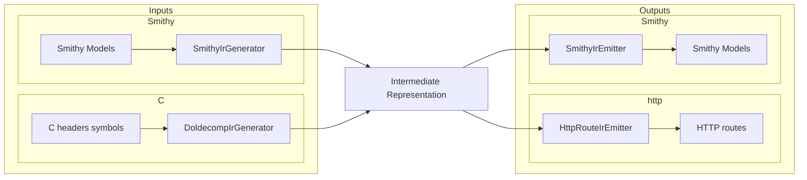

# AGENTS.md

## Cursor Cloud specific instructions

This is a Scala 2.13 / sbt project (build tool: `sbt`, JDK 21). `sbt` is preinstalled in the
Cloud VM snapshot and dependencies are refreshed by the startup update script (`sbt update`).

### Services / entrypoint

There is a single service: a read-only HTTP server that proxies debugger memory over DAP.
The entrypoint is `io.github.jacoby6000.daphttp.Cli` (a Decline CLI) with three subcommands:

- `smithy` — load API definitions from Smithy model files (`--smithy <path>` repeatable, `--watch`).
- `cheaders` — load from C headers + a doldecomp symbols file (`--symbols`, `--headers` repeatable,
  `--namespace`, `--service`, `--word-size`) and run the HTTP server.
- `cheaders-smithy` — generate a Smithy model from C headers + symbols (`--symbols`, `--headers`,
  `--namespace`, `--service`, `--word-size`, `--output`).

`smithy` and `cheaders` share `--dap-host/--dap-port` (default `127.0.0.1:4711`) and
`--bind-host/--bind-port` (default `0.0.0.0:8080`). Run with `sbt "run <subcommand> ..."`.
Standard build/lint/test commands are documented in `README.md` and `.github/workflows/ci.yml`
(`sbt fmt`, `sbt fix`, `sbt test`, and CI's `scalafmtCheckAll;scalafmtSbtCheck` /
`scalafixAll --check`).

### IR pipeline

Input formats converge on a shared IR, then emit HTTP routes or Smithy models:

`SmithyIrEmitter` builds a Smithy `Model` with smithy-model shape builders and serializes it via
`SmithyIdlModelSerializer` (do not hand-render Smithy IDL text).

### Non-obvious caveats

- `scalafmtOnCompile := true`, so `sbt compile` will reformat sources in place.
- The `/health` and `/routes` endpoints work without a debugger. On startup the server immediately
  tries to connect to the DAP adapter on `--dap-port` (1s TCP timeout per attempt, retrying every
  5s until connected). Generated **data** routes reuse that persistent TCP connection (serialized
  across concurrent requests); if the adapter is not listening they return per-read `error` fields
  (the HTTP request still succeeds). To exercise data routes locally without a real debugger, run a
  small mock TCP server that speaks the DAP `readMemory` framing (`Content-Length: N\r\n\r\n` +
  JSON body, responding with `{"success":true,"body":{"data":"<base64>"}}`).
- `IrSizingWarnings` logs non-fatal warnings to stderr when IR members use ambiguous Smithy
  prelude types (`Integer`, `Long`, `Float`, `Double`) without explicit width traits (`@u32`,
  `@f64`, etc.). Pointer members are excluded.
- First `sbt` invocation downloads sbt/Scala launchers and Coursier deps; expect a slow cold start.
