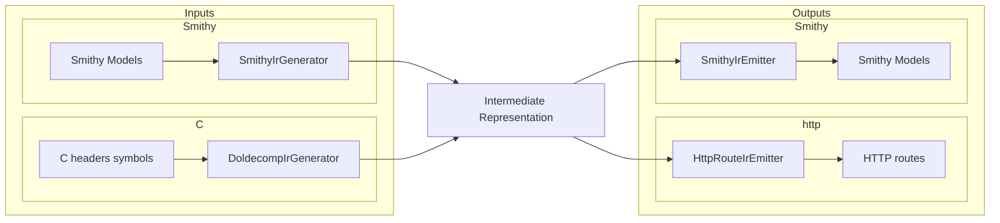

# AGENTS.md

## Cursor Cloud specific instructions

This is a Scala 2.13 / sbt project (build tool: `sbt`, JDK 21). `sbt` is preinstalled in the
Cloud VM snapshot and dependencies are refreshed by the startup update script (`sbt update`).

### Services / entrypoint

There is a single service: a read-only HTTP server that proxies debugger memory over DAP.
The entrypoint is `io.github.jacoby6000.daphttp.Cli` (a Decline CLI) with three subcommands:

- `smithy` — load API definitions from Smithy model files (`--smithy <path>` repeatable, `--watch`).
- `cheaders` — load from C headers + a doldecomp symbols file (`--symbols`, `--headers` repeatable,
  `--namespace`, `--service`, `--word-size`, `--data-sections`, `--report`) and run the HTTP server.
- `cheaders-smithy` — generate a Smithy model from C headers + symbols (`--symbols`, `--headers`,
  `--namespace`, `--service`, `--word-size`, `--data-sections`, `--report`, `--output`).

`smithy` and `cheaders` share DAP transport flags and `--bind-host/--bind-port`
(default `0.0.0.0:8080`), plus optional `--overlays <path>` (JSON file for client type
reinterpretation overlays; loaded at startup and rewritten on `PUT /overlays`). DAP transport is one of:

- TCP (default): `--dap-host/--dap-port` (default `127.0.0.1:4711`) — persistent TCP session
- Local pipe (client only): `--dap-pipe` — Unix domain socket (Linux/macOS) or Windows named
  pipe (`\\.\pipe\Name`)

Also shared: `--dap-timeout-ms`, `--dap-continue-timeout-ms`, `--dap-connect-timeout-ms`,
`--dap-connect-retry-ms`.

Intended peer for Melee/doldecomp workflows is the local `dolphin-dap` fork (sibling
`../dolphin-dap`), which listens via `Dolphin.General.DAPPort` (TCP) or
`Dolphin.General.DAPSocket` (Unix domain socket). Upstream Dolphin does not ship DAP yet.

Run with `sbt "run <subcommand> ..."`. Standard build/lint/test commands are documented in
`README.md` and `.github/workflows/ci.yml` (`sbt fmt`, `sbt fix`, `sbt test`, and CI's
`scalafmtCheckAll;scalafmtSbtCheck` / `scalafixAll --check`).

### DAP transport notes

- TCP client: `DapHttpServerMain.SocketDapClient`. Pipe/socket client: `LocalPipeDapClient`.
- Sessions are persistent and handshake with DAP `initialize`. Outbound requests are serialized;
  a background reader thread demuxes responses by `request_seq` and forwards
  `dolphin_memoryChanged` events while idle (required for realtime watches).
- `LocalPipeDapClient` opens the pipe/socket under cats-effect `Resource` so failed handshakes
  always close the connection; request waits use Futures with timeouts. Concurrent DAP requests
  are serialized with `Mutex[IO]`.
- We are always a **client** to an adapter-owned endpoint (never create the pipe/socket).
  `--dap-pipe` matches VS Code's "named pipe" path convention: AF_UNIX connect on Unix
  (dolphin-dap `DAPSocket`), `RandomAccessFile(..., "rw")` for Windows `\\.\pipe\Name`.
- Realtime watches (dolphin-dap): `POST /watches` `{ "path": "/api/…" }` → `dolphin_realtimeWatch`
  for that route’s region; `DELETE /watches/{id}` cancels; `GET /watches` lists. `GET /ws` pushes
  `{ type: "memoryChanged", path, decoded, … }` and `{ type: "watchesCleared" }` on DAP reconnect.
  The server emits WebSocket Ping frames every 20s so Ember’s idle timeout does not drop quiet
  sockets; Ember idle is also raised to 5 minutes. Watching a source field expands the DAP region
  to cover overlapping overlay members (byte-range mapping); `/ws` `memoryChanged` includes
  `overlayUpdates` and the UI patches those overlay fields in realtime (seeding `overlayDecoded`
  when needed) and marks them as watched. After `PUT /overlays` / Apply, the server rebinds
  active watches (and returns the updated list on the PUT response; failures appear as
  `watchErrors`) so mappings match the new document. Smithy `--watch` rebuilds the overlay
  engine, rebinds, and pushes `watchesRebound` on `/ws` so clients refresh watchIds. UI ◎/◉ toggles watches next
  to fetchable JSON fields.

### IR pipeline

Input formats converge on a shared IR, then emit HTTP routes or Smithy models:

`SmithyIrEmitter` builds a Smithy `Model` with smithy-model shape builders and serializes it via
`SmithyIdlModelSerializer` (do not hand-render Smithy IDL text).

### Modules

- **root / daphttp (JVM)** — under `modules/daphttp/`; CLI, IR pipeline, http4s server
  (`io.github.jacoby6000.daphttp.Cli`). HTTP routes compose as
  `DapProxyRoutes <+> WebAppRoutes <+> ApiRoutes` (DAP runtime under `/dap-proxy`,
  explorer/catalog/watches/ws at the root, generated data under `/api`).
  Path matching for GET/watches lives in `RoutePathResolver`; single-region DAP
  read/decode is shared via `MemoryDecodeService`. Smithy assembly is
  `SmithyModelLoader` (used by Cli and `DapHttpServerMain`).
- **ui (Scala.js)** — browser explorer under `modules/ui/`; `Compile / resourceGenerators`
  copies `fastOptJS` + `index.html` into `web/` resources served at `/` and `/assets/main.js`.
  The explorer keeps the full `/routes` catalog in memory but only renders search results in the
  left panel (name/struct/field substring, or `0x…` address match against tree node addresses).

### HTTP surface

| Path | Purpose |
|------|---------|
| `GET /` | HTML + Scala.js explorer (left tree + multi-tab struct workspace) |
| `GET /assets/main.js` | Packaged Scala.js bundle |
| `GET /health` | Liveness |
| `GET /routes` | Flat `routes` list + `tree` (nodes include optional `address`) + `errors` |
| `GET /types` | Searchable type catalog (primitives + IR structs/enums + overlay `newStructs`; no per-struct `fields`) |
| `GET /types/fields?id=` | Full field descriptors for one struct (editor pre-population) |
| `GET /overlays` | Current type-overlay document (`structs` + `newStructs`) |
| `PUT /overlays` | Replace overlays (validate; persist when `--overlays` was set) |
| `POST /dap-proxy/continue` | DAP `continue` (optional `{ "threadId": N }`) |
| `POST /dap-proxy/readMemory` | DAP `readMemory` (`memoryReference`, `count`, optional `offset`) |
| `POST /dap-proxy/writeMemory` | DAP `writeMemory` (`memoryReference`+`data`) or typed leaf write (`address`+`value`+`decodeType`+`segments`) |
| `POST /watches` | Subscribe to realtime memory for a data path (`{ "path": "/api/…" }`) |
| `DELETE /watches/{id}` | Cancel a realtime watch |
| `GET /watches` | List active watches |
| `GET /ws` | WebSocket push for `memoryChanged` / `watchesCleared` |
| `GET /api/...` | Generated memory / data routes (`decoded` plus optional `overlayDecoded`) |

### Non-obvious caveats

- `scalafmtOnCompile := true`, so `sbt compile` will reformat sources in place.
- Generated data routes are always under `/api` (`ApiRoutes.normalize`). Meta UI endpoints stay at
  the root so they never collide with a Smithy service named `api`. DAP runtime commands live under
  `/dap-proxy` (`DapProxyRoutes`) and mirror DAP request names (`continue`, `readMemory`,
  `writeMemory`).
- The `/health` and `/routes` endpoints work without a debugger. On startup the server immediately
  tries to connect to the DAP adapter (TCP or `--dap-pipe`; 1s TCP connect timeout per attempt,
  retrying every 5s until connected). Generated **data** routes reuse that persistent session
  (serialized across concurrent requests); if the adapter is not listening they return per-read
  `error` fields (the HTTP request still succeeds). To exercise data routes locally without a real
  debugger, run a mock that speaks DAP framing (`Content-Length: N\r\n\r\n` + JSON) over TCP or a
  Unix domain socket / Windows named pipe, responding with
  `{"success":true,"body":{"data":"<base64>"}}`.
- `IrSizingWarnings` logs non-fatal warnings to stderr when IR members use ambiguous Smithy
  prelude types (`Integer`, `Long`, `Float`, `Double`) without explicit width traits (`@u32`,
  `@f64`, etc.). Pointer members are excluded.
- C `enum` / Smithy `intEnum` values decode to the enumerator name in JSON. Values that do not
  match any enumerator decode as a hex literal (`0xN`), not a numeric type. Enumerator
  initializers, array bounds, and bitfield widths are evaluated with CDT `ValueFactory` after
  preprocessor expansion — never by hand-parsing `#define` text. Unevaluable explicit enum
  initializers warn instead of silently inventing sequential values. Consecutive same-type
  bitfields still split into allocation units of the declared type width, but an incomplete
  trailing unit is sized by bits used (byte-rounded), not a full `u32`/`u16` container — matching
  Metrowerks / doldecomp Melee layouts (e.g. `StartMeleeRules` `x0_*`…`x5_*` then `u8 x6` at
  offset 6). Anonymous in-struct
  `struct { … } field;` / `enum { … } field;` types are registered under the field declarator
  name (e.g. `FighterMatchInfo`) so they become nested IR structs/enums instead of falling back
  to word-sized ints. When scanning multiple
  headers, `*_Count` / `*_SelfCount` enumerator values are harvested iteratively (parse → inject
  valid Count sentinels as ScannerInfo macros → reparse, capped) so chains like
  `ftCo_MS_Count` → `ftMh_MS_Count` → `ftCh_MS_Count` resolve even when defining headers sort after
  consumers. Only Count sentinels that appear before any failed initializer in their enum are
  exported during enum reparse (avoids colliding with later redefinitions of the same enum tag).
  Count-macro reparse can expand a Count identifier away in its defining enum; all passes are
  merged and richer enum bodies win so sentinels like `StatsAttack_Count` stay in the constant
  table. After enums merge, enumerator values are kept in that table for array-bound lookup
  (e.g. `jobjs[HUD_PLACE_MAX]`) — they are not injected into CDT ScannerInfo (that OOM'd on
  Melee-scale corpora). Opaque type macros such as melee `UNK_T` (`void*`) are expanded when
  validating symbol types. Header sources are read once into a corpus; `.c` files have top-level
  aggregate/string initializers and function bodies neutralized before CDT (avoids OOM on data
  objects). Shared ScannerInfo + one declarations parse per file; field-initializer lengths only
  re-parse small (≤64KiB) `.c` files with real initializers intact.
- Decoded struct JSON includes `"_address": "0x…"`, `"_offsets": { field: byteOffset, … }`, and
  `"_pointer": true` on pointees followed from pointer members, on every struct object (root,
  nested members, and array elements of structs), including nested pointees from pointer routes.
  `_offsets` drives dual-view alignment; `_pointer` drives the ⌖ focus control. Top-level response
  envelopes no longer carry a separate `address`/`offset` field for the decoded value;
  `pointerAddress` on pointer sub-routes still names where the pointer slot itself was read.
  Parent-struct decode also follows non-function pointer members (and pointer arrays): each
  address is read and decoded into the field (NULL → `null`). Char pointers still become
  C strings; function pointers stay as raw address numbers. Follow depth is capped and
  previously visited pointee addresses are skipped so pointer cycles cannot hang decode.
- Member `@size(N)` (also structure `@size`) round-trips doldecomp symbol `size:` as
  `IrMember.readSizeBytes` through `cheaders-smithy` → `smithy`. Structure `@size` means
  declared width whose unit depends on the shape: **bytes** for `@dapStruct` /
  enclosing structs (`IrType.*.declaredSizeBytes`), **bits** for `@bitmask`
  (`IrType.Bitmask.storageBits`). On members it is the explicit DAP read width in bytes.
- Global arrays (including pointer arrays) use `readSizeBytes / length` as element stride when that
  exceeds packed layout/pointer width (padding between elements). Pointer-chain outer indices use
  the same stride. Enclosing outputs that unwrap to a root-level array (e.g. Melee `player_slots`)
  expose indexed element routes at `$basePath/{index}` so each element is fetchable/watchable in the
  UI — not only the outer array. Nested fields under those elements (and under named array members)
  resolve via `MemberPathResolver` (e.g. `$basePath/0/x`) so individual struct children can be
  watched without enumerating every field in `/routes`. Unsized aggregate arrays require a C declarator bound or initializer count:
  symbol size alone cannot distinguish element count from ABI stride padding. Object symbols in
  known code sections (`.text`, `.ctors`, `extab`, …) are summarized by section count (no
  `--data-sections` tip). Unknown sections still suggest `--data-sections`. Data symbols without
  `ctype`/C declarations and symbols whose resolved type is missing from `--headers` are summarized
  (sample names + count). When any symbol fails for a missing type, nearby directories
  (e.g. sibling `extern/dolphin/include`) are probed and suggested via warning only — never
  auto-added to the scan set. Pass extra `--headers` roots explicitly.
- Duplicate C globals for one symbol name merge deterministically: prefer non-`static` declarations
  with array length metadata; take `pointerDepth` from that primary (not `max`). Conflicting macros,
  structs, typedefs, and enums across scanned files keep the first definition and emit one summarized
  warning per kind. Pass `--report <path>` to write a Markdown file with the full per-name /
  per-symbol detail behind those summaries. `cheaders-smithy` fails when the service has zero
  operations. Non-fatal layout/array-bound notes go through `DiagnosticSink` so they appear in
  console, `IrGenerationResult.warnings`, and `IrDiagnostics.otherWarnings` (Markdown report).
- C typedefs of `int`/`float`/… (e.g. melee `enum_t`, `MessageBufferID`) set `primitiveOverride` so
  `IrSizingWarnings` does not treat them as ambiguous Smithy prelude Integer/Float.
- First `sbt` invocation downloads sbt/Scala launchers and Coursier deps; expect a slow cold start.
  Building the server also builds the Scala.js UI via `resourceGenerators`.
- UI route explorer: left panel is a search-driven file tree (results start collapsed; toolbar
  Expand all / Collapse all); the main pane is a multi-tab workspace. Tabs open only after a
  successful fetch/load of a concrete path; loading more paths adds tabs (close with ×). Each
  tab hosts source decode, overlay decode, and a collapsible struct editor (default collapsed;
  draft edits are per-tab, overlay document is global). Paths with `{index}` (arrays / pointer chains) show an index bar — enter indices and
  Fetch, or use Prev/Next to walk the first index until decode fails (error / null `decoded`).
  Concrete indexed children still fetch with ↻ as before. Source and overlay decode share one
  scrollable dual-column tree: fields align by byte offset when `_offsets` is present on decoded
  structs (renames share a row; offset-only sides leave gaps), else by name. Expand/collapse
  stays paired across renames. Missing sides show "—". Followed pointer pointees carry `_pointer`
  and show a ⌖ control that opens that value as a root tab (fetches the member route when
  available). Double-click a leaf value (with a known absolute address) to edit it; Enter writes
  via `POST /dap-proxy/writeMemory` → DAP `writeMemory`, then refreshes the tab. Object metadata keys (`_address`,
  `_offsets`, `_pointer`) are not treated as fields. Realtime watch updates patch leaf values in
  place (full rebuild only on shape change) so ◎ toggles stay clickable while watches stream.
  Fields that map to a
  fetchable member/array-element route show a per-field ↻ and ◎/◉ realtime watch toggle; each
  successful refresh (or watch update) stamps that subtree with the current time. Lines gray by
  `max(latestDataTime, now) - fieldFreshMs` (mild fade over the first minute, a clearer but still
  readable mute after 60s). Age styles refresh every couple of seconds without a full JSON
  rebuild. Collapsed JSON nodes are not built into the DOM until expanded; fetchable route paths
  are cached when `/routes` loads. IR warnings from `/routes` appear as a dismissible toast on
  catalog load, not a persistent banner.
- Memory-mapped struct layouts are **type-packed** via `IrLayout` (natural C/PowerPC-style
  alignment; on 32-bit word size, fundamental alignment is capped at 8 per PPC EABI.
  `#pragma pack` / packed attributes are not honored yet). Doldecomp `/* 0xN */` / `/* +N */`
  member offset comments are documentation only: they never stamp IR offsets. When a comment
  disagrees with the packed layout, `irSourceDoldecomp` logs a warning. When an array bound
  (e.g. `StatsAttack_Count`) does not resolve from the enumerator table, length may be inferred
  from the gap between adjacent offset comments (with a warning). The same packer is used for
  Smithy `@dapStruct` shapes, overlays, and the emitter fallback when offsets are missing.
- Type overlays (`--overlays`, UI editor): only structs the client changed are stored. Overlay
  layouts rebuild through `IrLayout` (same rules as C/Smithy IR). Widening a prior field still
  absorbs following pad when the new types pack without an alignment gap. Data routes keep source
  `decoded` and add `overlayDecoded` when an overlay touches the read type. Client-created structs
  live under `newStructs` (namespace `overlay#…` when unqualified). Overlays apply globally by
  struct shape id, not per-route.
