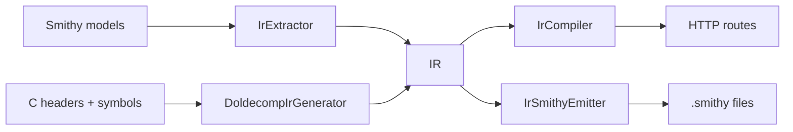

# dap-http-generator

Use Smithy models to define read-only HTTP servers that proxy debugger memory via DAP.

## Entrypoint

The runnable jar uses `io.github.jacoby6000.daphttp.Cli` (Decline CLI). A legacy flat-argument
entrypoint also exists at `io.github.jacoby6000.daphttp.DapHttpServerMain`.

### CLI subcommands

| Subcommand | Purpose |
|------------|---------|
| `smithy` | Load `.smithy` models and run the HTTP server |
| `cheaders` | Load C headers + doldecomp symbols and run the HTTP server directly |
| `cheaders-smithy` | Generate a `.smithy` file from C headers + doldecomp symbols |

Server subcommands (`smithy`, `cheaders`) share these flags:

- `--dap-host` / `--dap-port` (default `127.0.0.1:4711`) — DAP debug adapter
- `--bind-host` / `--bind-port` (default `0.0.0.0:8080`) — HTTP server bind address

`smithy` also supports `--watch` to reload models when files change.

### Custom C/DAP traits

Traits are defined in `src/main/smithy/dap-http-traits.smithy`:

- `@dapStruct` marks structures that should be decoded from DAP bytes.
- `@bitmask` marks a structure as a bitmask.
- `@size(<n>)` sets an expected structure width (required for `@bitmask`).
- `@alignment(<n>)` sets struct/member byte alignment.
- `@padding(<n>)` applies repeated bit/byte padding to `Bits`/`Bytes` list members.
- `@pointer` marks a member as a pointer-sized field.
- `@array` marks list members as arrays.
- `@length(<n>)` sets array element count for non-pointer list members.
- `@staticAddress(<address>)` marks the debugger memory address used for members inside non-`@dapStruct` shapes.
- `@endian("big" | "little")` sets default service/member byte order (member overrides service default).
- `@wordSize(<n>)` is required on services and sets pointer/`Long` bit width.
- Model C strings as `@pointer` members targeting `@char`; decoding follows the pointer and reads ASCII bytes until a null terminator.
- Numeric member traits: `@u8`, `@s8`, `@u16`, `@s16`, `@u32`, `@s32`, `@u64`, `@s64`, `@u128`, `@s128`, `@f8`, `@f16`, `@f32`, `@f64`, `@char`.
- Convenience list types: `Bytes` (`list<Byte>`) and `Bits` (`list<Boolean>`).

### Sizing annotations

Members mapped from Smithy prelude types (`Integer`, `Long`, `Float`, `Double`) must declare an
explicit width trait (for example `@u32`, `@f64`, `@f16`). Plain prelude types are ambiguous
because integer and long widths can vary with `@wordSize`, and float members may be `@f8`,
`@f16`, `@f32`, or `@f64`.

When models are loaded or compiled, `IrSizingWarnings` logs non-fatal warnings to stderr for
members that lack explicit sizing. Pointer members are excluded (they intentionally follow service
`@wordSize`).

### Architecture

All input pipelines converge on a shared IR, then compile to HTTP route plans:



- **`IrExtractor`** — Smithy model → IR
- **`DoldecompIrGenerator`** — C headers + doldecomp symbols → IR
- **`IrSmithyEmitter`** — IR → Smithy model (via smithy-model builders + `SmithyIdlModelSerializer`)
- **`IrCompiler`** — IR → route plans (memory reads + JSON codecs)

### Runtime behavior

The server:

- loads API definitions from Smithy models or C headers,
- generates read-only GET routes from service operations (`/<ServiceName>/<OperationName>`),
- requires non-DAP output members to use `@staticAddress(...)`,
- resolves DAP-backed structs (`@dapStruct`/`@bitmask`) and reads memory through a DAP `readMemory` request,
- watches Smithy sources and reloads routes when model files change (`smithy --watch`).

`/health` and `/routes` work without a debugger attached. Generated **data** routes open a fresh
TCP socket per read to the DAP adapter; if nothing is listening they return per-read `error`
fields while the HTTP request still succeeds.

### Running locally

From Smithy models:

```bash
sbt "run smithy --smithy /absolute/path/to/models --watch --bind-port 8080"
```

From C headers (direct to server):

```bash
sbt "run cheaders \
  --symbols /absolute/path/to/symbols.txt \
  --headers /absolute/path/to/include \
  --word-size 32 \
  --bind-port 8080"
```

Generate Smithy from C headers, then serve it:

```bash
sbt "run cheaders-smithy \
  --symbols /absolute/path/to/symbols.txt \
  --headers /absolute/path/to/include \
  --namespace doldecomp.generated \
  --service DolDecompApi \
  --word-size 32 \
  --output /absolute/path/to/generated.smithy"

sbt "run smithy --smithy /absolute/path/to/generated.smithy --bind-port 8080"
```

Legacy flat-argument entrypoint:

```bash
sbt "runMain io.github.jacoby6000.daphttp.DapHttpServerMain \
  --smithy=/absolute/path/to/models \
  --dapHost=127.0.0.1 \
  --dapPort=4711 \
  --bindPort=8080 \
  --watch=true"
```

### Formatting, linting, and tests

```bash
sbt fmt
sbt fix
sbt test
```
