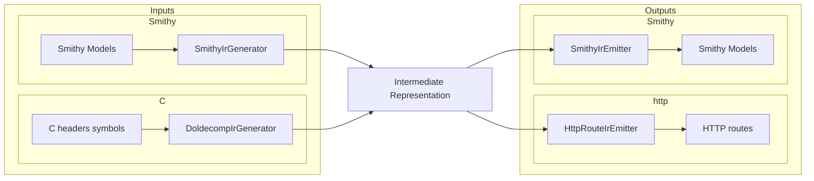

# dap-http-generator

Use Smithy models to define read-only HTTP servers that proxy debugger memory via DAP.

## Entrypoint

The runnable jar uses `io.github.jacoby6000.daphttp.Cli` (Decline CLI). A legacy flat-argument
entrypoint also exists at `io.github.jacoby6000.daphttp.DapHttpServerMain`.

### CLI subcommands

| Subcommand | Purpose |
|------------|---------|
| `smithy` | Load `.smithy` models and run the HTTP server |
| `cheaders` | Load C headers + doldecomp symbols and run the HTTP server directly |
| `cheaders-smithy` | Generate a `.smithy` file from C headers + doldecomp symbols |

Server subcommands (`smithy`, `cheaders`) share these flags:

- DAP transport (choose one):
  - TCP (default): `--dap-host` / `--dap-port` (default `127.0.0.1:4711`)
  - Local pipe: `--dap-pipe <path>` — Unix domain socket
    (e.g. dolphin-dap `DAPSocket=/tmp/dolphin-dap.sock`) or Windows named pipe
    (`\\.\pipe\Name`)
- `--dap-timeout-ms` (default `5000`) — DAP read timeout for memory reads
- `--dap-continue-timeout-ms` (default `30000`) — DAP read timeout for `POST /resume`
- `--dap-connect-timeout-ms` (default `1000`) — TCP connect timeout per DAP attempt
- `--dap-connect-retry-ms` (default `5000`) — delay between DAP connect attempts at startup
- `--bind-host` / `--bind-port` (default `0.0.0.0:8080`) — HTTP server bind address
- `--overlays <path>` (optional) — load/save client type reinterpretation overlays (JSON).
  The UI editor `PUT`s overlays here so reinterpretations survive restarts.

`smithy` also supports `--watch` to reload models when files change.

`cheaders` and `cheaders-smithy` also support:

- `--word-size` (default `32`) — pointer word size in bits (use `64` for 64-bit targets)
- `--data-sections` (optional) — comma-separated list of additional section names to scan
  for data symbols (e.g. `--data-sections .mydata,.custom`). The known data sections
  (`.data`, `.sdata`, `.sdata2`, `.sbss`, `.bss`, `.rodata`) are always included automatically.
  Unknown sections that don't match known data or code patterns are logged as warnings and
  skipped; use this flag to include them.
- `--report <path>` (optional) — write a Markdown diagnostics report with full lists of skipped
  symbols, missing types, and conflicting macros/structs/enums (console stays summarized).

### Custom C/DAP traits

Traits are defined in `src/main/smithy/dap-http-traits.smithy`:

- `@dapStruct` marks structures that should be decoded from DAP bytes.
- `@bitmask` marks a structure as a bitmask.
- `@size(<n>)` sets an expected structure width (required for `@bitmask`).
- `@alignment(<n>)` sets struct/member byte alignment.
- `@padding(<n>)` applies repeated bit/byte padding to `Bits`/`Bytes` list members.
- `@pointer` marks a member as a pointer-sized field.
- `@array` marks list members as arrays.
- `@length(<n>)` sets array element count for non-pointer list members.
- `@staticAddress(<address>)` marks the debugger memory address used for members inside non-`@dapStruct` shapes.
- `@endian("big" | "little")` sets default service/member byte order (member overrides service default).
- `@wordSize(<n>)` is required on services and sets pointer/`Long` bit width.
- C `char` arrays (`char name[N]`) decode as null-terminated ASCII strings. C `char*` pointers decode as null-terminated strings by following the pointer. In Smithy models, use `@array @length(N)` with `@char` for inline buffers and `@pointer @char` for pointers.
- Numeric member traits: `@u8`, `@s8`, `@u16`, `@s16`, `@u32`, `@s32`, `@u64`, `@s64`, `@u128`, `@s128`, `@f8`, `@f16`, `@f32`, `@f64`, `@char`.
- Convenience list types: `Bytes` (`list<Byte>`) and `Bits` (`list<Boolean>`).

### Sizing annotations

Members mapped from Smithy prelude types (`Integer`, `Long`, `Float`, `Double`) must declare an
explicit width trait (for example `@u32`, `@f64`, `@f16`). Plain prelude types are ambiguous
because integer and long widths can vary with `@wordSize`, and float members may be `@f8`,
`@f16`, `@f32`, or `@f64`.

When models are loaded or compiled, `IrSizingWarnings` logs non-fatal warnings to stderr for
members that lack explicit sizing. Pointer members are excluded (they intentionally follow service
`@wordSize`).

### Architecture

All input pipelines converge on a shared intermediate representation (IR), then emit HTTP routes or Smithy models:



- **`SmithyIrGenerator`** — Smithy model → IR
- **`DoldecompIrGenerator`** — C headers + doldecomp symbols → IR
- **`SmithyIrEmitter`** — IR → Smithy model (via smithy-model builders + `SmithyIdlModelSerializer`)
- **`HttpRouteIrEmitter`** — IR → route plans (memory reads + JSON codecs)

### Runtime behavior

The server:

- loads API definitions from Smithy models or C headers,
- generates read-only GET data routes under `/api/<ServiceName>/...`,
- serves an HTML + Scala.js explorer at `/` that mirrors those routes (collapse/expand + per-node refresh),
- requires non-DAP output members to use `@staticAddress(...)`,
- resolves DAP-backed structs (`@dapStruct`/`@bitmask`) and reads memory through a DAP `readMemory` request,
- watches Smithy sources and reloads routes when model files change (`smithy --watch`).

`/`, `/health`, `/routes`, and `POST /resume` work without a debugger. `/routes` returns both a flat
`routes` list and a `tree` for the UI. On startup the server immediately tries to connect to the DAP
adapter over TCP or `--dap-pipe` (1s TCP connect timeout per attempt, retrying every 5s until
connected). `/resume` reuses the persistent DAP session (then sends `continue`). Use it when the
target is stopped and `readMemory` times out. Generated **data** routes use the same connection for
`readMemory` (serialized under a lock); if the connection drops the client reconnects. If nothing is
listening they return per-read `error` fields while the HTTP request still succeeds.

### Running locally

From Smithy models:

```bash
sbt "run smithy --smithy /absolute/path/to/models --watch --bind-port 8080"
```

Resume a stopped debug target before reading memory:

```bash
curl -X POST localhost:8080/resume
```

From C headers (direct to server):

```bash
sbt "run cheaders \
  --symbols /absolute/path/to/symbols.txt \
  --headers /absolute/path/to/src \
  --word-size 32 \
  --bind-port 8080"
```

For Melee/doldecomp, pass both game sources and the Dolphin SDK include tree so types like
`Vec3` / `GXColor` resolve. If those types are missing, cheaders warns and may suggest nearby
paths (for example `…/melee/extern/dolphin/include`) — it does not add them automatically:

```bash
sbt "run cheaders \
  --symbols $HOME/projects/ai/yolo/melee/config/GALE01/symbols.txt \
  --headers $HOME/projects/ai/yolo/melee/src \
  --headers $HOME/projects/ai/yolo/melee/extern/dolphin/include \
  --word-size 32 \
  --bind-port 8080 \
  --dap-pipe ../dolphin-dap/dap.sock"
```

Local DAP pipe (client to an existing endpoint):

```bash
# Linux: Unix domain socket (dolphin-dap Dolphin.General.DAPSocket)
sbt "run smithy --smithy /absolute/path/to/models \
  --dap-pipe /tmp/dolphin-dap.sock \
  --bind-port 8080"

# Windows: named pipe created by the adapter
sbt "run smithy --smithy /absolute/path/to/models \
  --dap-pipe \\\\.\\pipe\\MyDapAdapter \
  --bind-port 8080"
```

TCP attach (dolphin-dap `Dolphin.General.DAPPort`):

```bash
sbt "run smithy --smithy /absolute/path/to/models \
  --dap-host 127.0.0.1 \
  --dap-port 5678 \
  --bind-port 8080"
```

`cheaders` matches object symbols in data sections (`.data`, `.sdata`, `.sdata2`, `.sbss`,
`.bss`, `.rodata`) to global variable declarations in `.h` and `.c`
files under `--headers` (for example `GameScene gm_803DDAC0_Scenes[]` in source paired with
`gm_803DDAC0_Scenes = .data:0x803DDAC0;` in `symbols.txt`). Unsized array lengths are inferred
from the number of entries in a matching C initializer when present (for example two `{ ... }`
elements in a `.c` definition). The optional `ctype:` symbol attribute still overrides inferred
types when present.

Generate Smithy from C headers, then serve it:

```bash
sbt "run cheaders-smithy \
  --symbols /absolute/path/to/symbols.txt \
  --headers /absolute/path/to/include \
  --namespace doldecomp.generated \
  --service DolDecompApi \
  --word-size 32 \
  --output /absolute/path/to/generated.smithy"

sbt "run smithy --smithy /absolute/path/to/generated.smithy --bind-port 8080"
```

Legacy flat-argument entrypoint:

```bash
sbt "runMain io.github.jacoby6000.daphttp.DapHttpServerMain \
  --smithy=/absolute/path/to/models \
  --dapHost=127.0.0.1 \
  --dapPort=4711 \
  --bindPort=8080 \
  --watch=true"
```

### Formatting, linting, and tests

```bash
sbt fmt
sbt fix
sbt test
```

### Logging

Logging uses SLF4J with Logback. Configure levels in `src/main/resources/logback.xml`:

| Logger | Layer |
|--------|-------|
| `io.github.jacoby6000.daphttp.dap` | DAP `readMemory` requests/responses |
| `io.github.jacoby6000.daphttp.http` | HTTP request/response lines |
| `io.github.jacoby6000.daphttp.ir.emit` | IR → route plans (`HttpRouteIrEmitter`) |
| `io.github.jacoby6000.daphttp.ir.source.smithy` | Smithy model → IR |
| `io.github.jacoby6000.daphttp.ir.source.doldecomp` | C headers/symbols → IR |

Set a logger to `DEBUG` for per-route or per-symbol detail. Example:

```xml
<logger name="io.github.jacoby6000.daphttp.ir.source.doldecomp" level="DEBUG"/>
```

Override the config file at runtime with:

```bash
java -Dlogback.configurationFile=/path/to/logback.xml -jar ...
```
